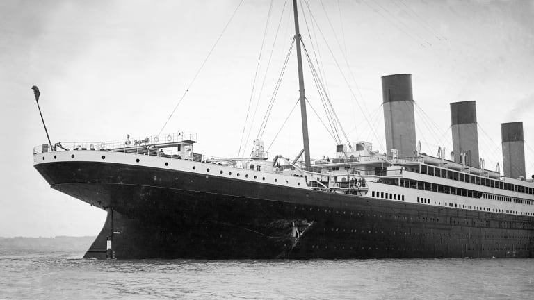
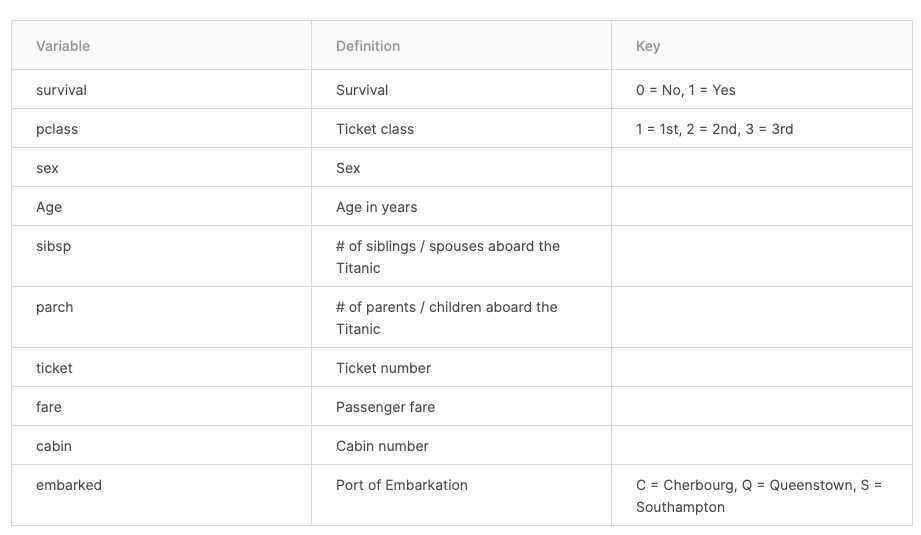

# Project:  Titanic Binary Classification 

## Introduction
The sinking of the Titanic is one of the most infamous shipwrecks in history.

On April 15, 1912, during her maiden voyage, the widely considered “unsinkable” RMS Titanic sank after colliding with an iceberg. Unfortunately, there weren’t enough lifeboats for everyone onboard, resulting in the death of 1502 out of 2224 passengers and crew.

While there was some element of luck involved in surviving, it seems some groups of people were more likely to survive than others.

## Data
The data is from [Kaggle.com](https://www.kaggle.com/c/titanic/overview) and this is a prediction competition (Challenge) on the Kaggle.com.
- **Attribute information**

## Goal
The goal of this project is to build a predictive model that answers the question: “what sorts of people were more likely to survive?” using passenger data (ie name, age, gender, socio-economic class, etc). For this project, the oversampling method was applied to balance two classes. The model stacking methods was used to predict the target. There are two sections for the modeling part: 
-At First Level:
    - Logistic Regression
    - Random Forest
    - Neural NetworkAt
- At Second Level:
    -  I collected all the outputs from the first level and used those outputs as new features for the second level.The XGboost model was applied in this section.
