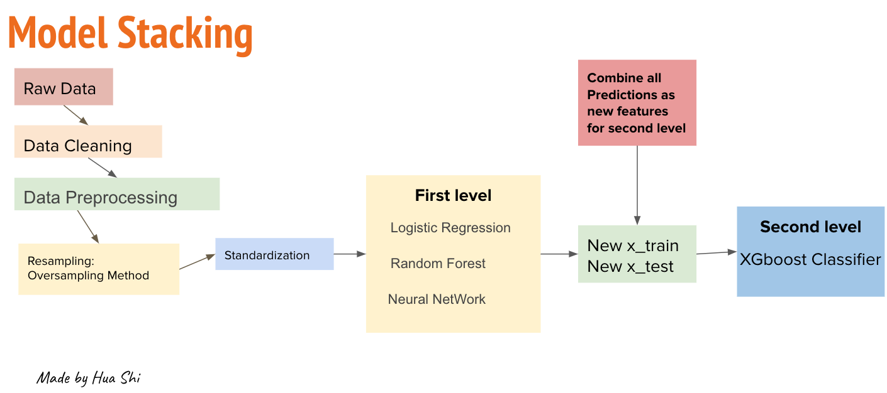

# Project:  Titanic Binary Classification 

## Introduction
The sinking of the Titanic is one of the most infamous shipwrecks in history.

On April 15, 1912, during her maiden voyage, the widely considered “unsinkable” RMS Titanic sank after colliding with an iceberg. Unfortunately, there weren’t enough lifeboats for everyone onboard, resulting in the death of 1502 out of 2224 passengers and crew.

While there was some element of luck involved in surviving, it seems some groups of people were more likely to survive than others.
## Data
The data is from [Kaggle.com](https://www.kaggle.com/c/titanic/overview) and this is a prediction competition (Challenge) on the Kaggle.com.
- **Attribute information**

## Goal
The goal of this project is to build a predictive model that answers the question: “what sorts of people were more likely to survive?” using passenger data (ie name, age, gender, socio-economic class, etc). For this project, the oversampling method was applied to balance two classes. The model stacking methods was used to predict the target. There are two sections for the modeling part: 
- At First Level:
    - Logistic Regression
    - Random Forest
    - Neural Network
- At Second Level:
    -  I collected all the outputs from the first level and used those outputs as new features for the second level.The XGboost model was applied in this section.
## Data Cleansing and Data Pre-processing
There are four columns contains missing values - Age, Cabin, Embarked. The percentage of missing values in the column of Age is  (177/891=0.198) less than 20%. Age is missing in around 20% of cases, it is better to impute them rather than ignore the variable. If there is a dataset that have small outliers, I'll prefer mean. Cabin is missing more than 77% of cases and cannot offer us useful information for our prediction. For more information please click this [link](https://en.wikipedia.org/wiki/Imputation_(statistics))! For the missing values of categorical data, the modes of those categorical variables filled the missing values.

## Distribution

- Pclasses
There are 3 different Pclasses and most people are in the 3rd class and the the numner of the people who are in the first and second class are simiar 
- Age
Based on the distribution of Age, we can observe that the mean of age is around 30
and we can see there is a outlier located in left tail 
which means some babies and kids
- Gender 
We can see that most people are males and the data of females and males are not balanced.
- Oversampling

## Model Stacking

There are two parts at first level, text data analysis and non_text data analysis. For text data , Logistic Regression, Random Forest, Neural Network and  were applies and obtained each model's predictions for train data and validation data.
At second level, All three outputs from first level were combined as new features and XGboost was applied to predict out final target. 
The score is up to 91.70% 
## Confusion Matrix and Prediction

